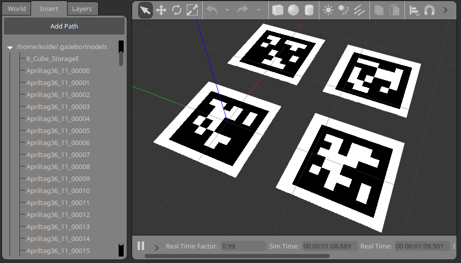

# gazebo_apriltag



Install models by running:
```bash
cp -R gazebo_apriltag/models/* ~/.gazebo/models/
```

Or, add the full path to `gazebo_apriltag/models/` to the `GAZEBO_MODEL_PATH` environment variable.

Generate additional tag models:
```bash
# Edit the following lines in generate.py to create tag models you want
# 45:	for i in range(16):
# 46:		generator.generate('apriltag-imgs/tag36h11', 'tag36_11_%05d' % i, tag_size)
```
